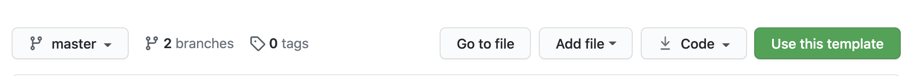
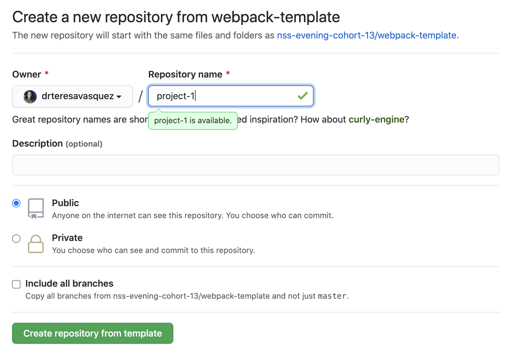
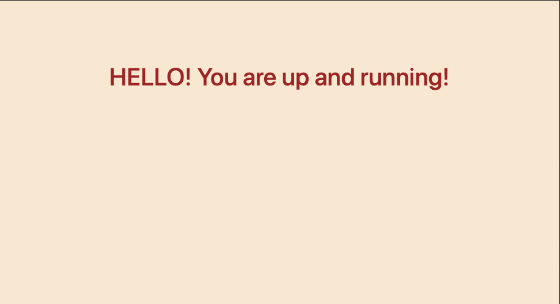
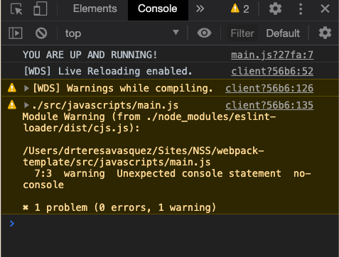

# Webpack Intro

[See Live Demo](https://webpack-temp.netlify.app/)

Webpack is a task runner and a module bundler. It originally started as a module bundler. This means that it takes all of your separate Javascript modules and bundles them together into a single file. Webpack also automates some of the tasks that we have to run every time we change the code. It will automate these tasks so that we are not typing in the same commands every single time.

- Visit the [Webpack documentation](https://webpack.js.org/concepts/) if you want to explore more.
- [Info on our Webpack Config](https://github.com/nss-nightclass-projects/Night-Class-Resources/blob/master/book-2-patterns-and-tools/chapters/webpack-configure.md)

## Get Started

### Use Template
#### 1. To get started, click the GREEN "Use this Template" button at the top of the repo


#### 2. Make sure YOUR github account is selected in the dropdown and name your project


3. Click the **GREEN** "Create repository from template" button
4. Clone your new repo to your local machine
5. Start working!

## Starting the Project
1. Open the `package.json` file and change the `name` property to the name of your application, and `author` to  your name.
1. From your command line, be in the root directory and run `npm install` OR `npm i` for short.
1. To start your application, run `npm start`

### If you see this, you are set to go!


**NOTE:** Changes you make to the project will make the browser reload on save...no more hard refresh unless something goes wrong.

## Other Important Tidbits
### Console messages
From this time forward, you will be expected to have a clean console in order for your assignments to be approved. This means that the use of `console.log` is acceptable **_(debugger is WAY better though)_** while developing, but will throw a warning in your console like the image below, but all `logs` will have to be removed. You may use `console.error` and `console.warn` in your code however.



### Including Images with Webpack
If you have a folder of local images that you want to load into your code things get a little strange with webpack.  Remember the only way webpack knows about assets is if they are imported into your javascript files.  Even our CSS is not added until those files are imported into our javascript files.  Below is some sample code for how to load a local image file into your project

```js
import cat from './assets/cat.jpg';

let domString = ``;

document.getElementById('cat').innerHTMl = domString;
```

### Importing CSS/SCSS
```js
import '../styles/main.scss';

const init = () => {
  $('#app').html('<h1>HELLO! You are up and running!</h1>');
  console.log('YOU ARE UP AND RUNNING!');
};

init();
```

### Using Axios
> For every file you will need to make an XHR request in, you will need to require Axios
```js
import axios from 'axios';

const examplePromise = () => {
  axios.get('http://localhost:3001/example')
    .then((data) => {
      console.warn(data);
    })
    .catch((error) => {
      console.error(error);
    });
});
```

### Deploying on Netlify

- Build Command: `npm run build`
- Publish directory: `build`
